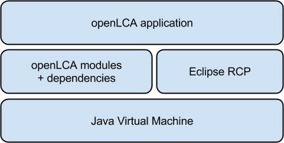
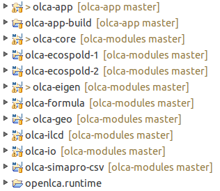
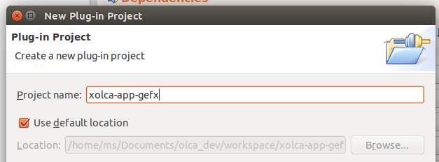
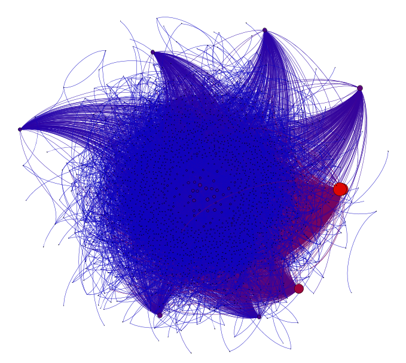

**This is a very old and outdated example plugin for openLCA. This was created**
**for a developer training several years ago.**

Introduction
============

openLCA[^1] is a free, professional Life Cycle Assessment (LCA) and
footprint software. It is an open-source software and licensed under the
Mozilla Public License version 2.0[^2]. Thus, the software is fully
transparent and can be modified by anyone. Additionally, it is possible
to add new functionality to openLCA via plugins. This guide explains how
you can set up a development environment to build openLCA from source
and explains the general structure of the openLCA source code. It also
shows in a small example how you can develop an openLCA plugin.

The picture below shows the overall architecture of openLCA. It is a
Java application that runs on the Eclipse Rich Client Platform
(RCP)[^3]. However, the core functionality is independent from the
Eclipse runtime and can be integrated in every other application that
runs on the Java Virtual Machine (JVM). This core functionality is
bundled in a project called `olca-modules` (the openLCA modules) whereas
the project name of openLCA application is `olca-app` (the openLCA
application).



The official source code repository of the `olca-modules` project is
<https://github.com/GreenDelta/olca-modules> and for the `olca-app`
project it is <https://github.com/GreenDelta/olca-app>.

Setting up a development environment
====================================

Java
----

As openLCA is a Java application, the first thing you should install is
the Java Development Kit (JDK). The openLCA application uses features of
Java 8 and therefore you need the JDK 8 to build the application. If you
just want to build the openLCA modules the JDK 7 should be sufficient.
We recommend to use Oracle Java[^4] but it should also work with Open
JDK[^5]. For Windows and Mac OS X you can just use the installers
provided on the Oracle download site. For Linux the best procedure is
probably the one described here:
[ http://askubuntu.com/questions/56104/how-can-i-install-sun-oracles-proprietary-java-jdk-6-7-8-or-jre]( http://askubuntu.com/questions/56104/how-can-i-install-sun-oracles-proprietary-java-jdk-6-7-8-or-jre).

Manage the source code via Git
------------------------------

The source code of openLCA is managed via Git[^6] and hosted on
Github[^7]. You can find the source repository of the openLCA modules
under <https://github.com/GreenDelta/olca-modules> and the repository of
the openLCA application under https://github.com/GreenDelta/olca-app.
The easiest way to get the code and to stay up to date with the
development of openLCA is to install git and clone these repositories:

```bash
git clone https://github.com/GreenDelta/olca-app
git clone https://github.com/GreenDelta/olca-modules
```

This will create the two folders `olca-app` and `olca-modules` in the
current directory which contain the complete source code.

Maven and missing dependencies
------------------------------

We use Maven[^8] to manage the build and the dependencies of the openLCA
modules and for the dependency management in the openLCA application.
Thus, you need to have Maven installed. The `olca-modules` is a Maven
multi-modules project. If you navigate to this repository and type

```bash
mvn install -DskipTests=true
```

Maven will try to build and install all the sub-modules of this project
into your local repository. If you do this the first time the build will
probably fail because we need ojAlgo[^9] which is unfortunately not
managed via the central Maven repository. Thus, we need to download
ojAlgo and install it into our local repository manually. Therefore,
download the current ojAlgo package and install the `ojalgo-VERSION.jar`
using the following command:

```bash
mvn install:install-file -Dfile=ojalgo-VERSION.jar \ 
-DgroupId=org.ojalgo -DartifactId=ojalgo \
-Dversion=VERSION -Dpackaging=jar
```

You may also have to change the version in the dependency declaration in
the file `olca-modules/olca-core/pom.xml`:

```xml
<dependency>
    <groupId>org.ojalgo</groupId>
    <artifactId>ojalgo</artifactId>
    <version>VERSION</version>
</dependency>
```

If you run the install command again everything should work now. [^10]
Now we need to copy our openLCA modules libraries and all the other
dependencies into the openLCA application project. We also use a Maven
script for this task which is located under `olca-app/olca-app/pom.xml`.
To make the development cycle a bit more convenient there is a small
shell/batch script located in the `olca-app` project which combines all
the Maven related tasks:

```bash
 # compile and install olca-modules and update 
 # the dependencies in olca-app
 ./olca-app/update_modules.sh
```

Eclipse
-------

The `olca-modules` and `olca-app` projects are already configured as
Eclipse projects. Thus, you can directly import them into an Eclipse
project. Select the folder where your code repositories are located and
you can import these projects like in the following picture:


After the import you will see again a lot of errors which we will fix in
the following. First, install the Maven integration for Eclipse from the
Eclipse Marketplace (Help/Marketplace):


Then, download the runtime project from
[ https://drive.google.com/file/d/0Bw9cXD8IWJzzRERLLVNXU19oNGM/edit?usp=sharing]( https://drive.google.com/file/d/0Bw9cXD8IWJzzRERLLVNXU19oNGM/edit?usp=sharing)
and import it as existing project into the workspace (chose 'Select
archive file'):


Open the file `platform.target` in the runtime project and click the
option `Set as target platform` in the target definition editor.

Finally, set the JDK 8 as the default Java runtime under
Preferences/Java/Installed JREs and the compiler compliance level to 1.8
under Preferences/Java/Compiler.

Project structure and development cycle
=======================================

Project structure
-----------------

When you set up your development environment as described above you
should see the following projects in the Eclipse workspace:



* `olca-app`: 
    Contains the openLCA application that is based on Eclipse RCP: the
    user interface, editor logic, database management etc.
* `olca-app-build`:
    Contains the build scripts, tools, and runtimes for compiling and
    packaging the RCP application for Windows, Linux, and Mac OS.
* `olca-core`:
    Contains the openLCA data model, calculation procedures, and
    functionality for interacting with a database.
* `olca-ecospold-1`:
    Contains the data model for automatic binding of EcoSpold 1 XML
    files to object graphs and the other way around.
* `olca-ecospold-2`:
    Same as olca-ecospold-1 but for the EcoSpold 2 data format.
* `olca-eigen`:
    Provides JNI[^11] wrappers to the high performance math libraries
    OpenBLAS[^12] and Eigen[^13].
* `olca-formula`:
    Contains a formula interpreter that is used for parameter evaluation
    in different scopes in openLCA.
* `olca-geo`:
    Contains the functionality for localized LCIA calculations including
    the handling of shapefiles and KML data.
* `olca-ilcd`:
    Contains the data model for automatic binding of ILCD XML files to
    object graphs and the other way around. It supports the storing and
    reading of ILCD files from folders, ZIP files, and ILCD network
    nodes (i.e. soda4LCA servers[^14]).
* `olca-io`:
    Contains the mappings and export/import interfaces from the openLCA
    data model to various data formats.
* `olca-simapro-csv`:
    Contains a parser and data model for reading SimaPro CSV files.
* `openlca.runtime`:
    Contains the dependencies (i.e. the OSGi bundles) of the openLCA RCP
    application.

Each project should also have a README file in its root folder which
explains the content and structure of the respective project in more
detail.

The development cycle
---------------------

As the olca-app and olca-modules project are independent from each
other, the modules have to be updated in the olca-app project when they
changed. We use Maven (as described above) to automate these updates.
Just run the `update_modules.bat/sh` script when you changed something
in the olca-modules and it will build the modules, install them in your
local Maven repository, and update them in your olca-app project.

Make the tests running
----------------------

The openLCA modules projects contain quite some unit tests which you can
run with the standard Maven test command or via the user interface of
your Java IDE. When you download the source code repository these tests
will initially fail because of the missing native libraries in the
olca-eigen module. You can fix this by either compiling the native
libraries by yourself or copying the prepared builds into the olca-eigen
project following the instructions in this READEME file:
<https://github.com/GreenDelta/olca-modules/tree/master/olca-eigen>. The
folder structure of the olca-eigen project should look like this (you
only need the library for your operating system):

{height="200px"}

Plugin development
==================

Because the openLCA application is based on the Eclipse Rich Client
Platform we can use the Eclipse plugin features also in openLCA. With
this it is possible to develop and distribute additional functionalities
as add-ons/plugins. In the following the development of a plugin is
described on a practical exampled. It is assumed that the development
environment is already set up as described above. This project is open
source[^15] and you can use it as a template for the development of
other openLCA plugins.

The example: an GEXF export of product systems
----------------------------------------------

In the following we will develop a plugin for the export of product
system graphs as GEXF files. GEXF stands for Graph Exchange XML
Format[^16] which is an open format for exchanging graphs and networks.
We will develop a simple but nice export so that we can open and
visualize a product system graph in Gephi[^17].

Create the plugin
-----------------

We create a new plugin `xolca-app-gefx` and keep the settings in the
wizard (except for the package names which we make a bit more Java
friendly):



After this the new plugin project looks like this:

{height="200px"}

Now we copy the product configuration `openLCA.product` from the
`olca-app` project into the plugin project and rename it, e.g.
`gefx_export.product`. Then we open the product configuration and add
our plugin in the dependency tab:


When we now run this configuration our plugin is loaded and we can test
its functionality.

(TODO: picture: plugin in configuration details; Java 8 entry in
manifest may results in a problem - fixed in Eclipse 4.4?)

Finally, we add the `olca-app` bundle to the plugin dependencies so that
we can use the openLCA API. Therefore open the `MANIFEST.MF` and add the
`olca-app` entry:

{height="150px"}

Adding the export wizard
------------------------

We now write the export wizard:

```java
public class ExportWizard extends Wizard implements IExportWizard{
  
  private ModelSelectionPage page;
    
  @Override
  public void init(IWorkbench workbench, 
    IStructuredSelection selection) {
    setWindowTitle("Export product system as GEXF file");
    setNeedsProgressMonitor(true);
  }

  @Override
  public void addPages() {
    page = new ModelSelectionPage(ModelType.PRODUCT_SYSTEM);
    addPage(page);
  }
    
  @Override
  public boolean performFinish() {
    File dir = page.getExportDestination();
    List<BaseDescriptor> models = page.getSelectedModels();
    if(dir == null || models.isEmpty())
      return true;
    // TODO: write export functionality
    return false;
  }
}
```

And we register the wizard in the `plugin.xml` of our project:

```xml
<?xml version="1.0" encoding="UTF-8"?>
<?eclipse version="3.4"?>
<plugin>
 <extension
  point="org.eclipse.ui.exportWizards">
    <wizard
      class="org.openlca.xolca.app.gefx.ExportWizard"
      id="xolca-app-gefx.ExportWizard"
      name="GEXF Export">
    </wizard>
 </extension>
</plugin>
```

When we run our product configuration now the plugin should be
registered in the export wizards:


Writing the export
------------------

The details of the export can be seen in the source code of the plugin.
First we created our GEXF data model. For the XML serialization we used
JAXB[^18] and annotated our model respectively. The mapping of the
product system graph to the GEXF model is done in the class `Export`.
The final project structure looks like this:

{height="250px"}

Finally, we call our export in the wizard:

```java
@Override
public boolean performFinish() {
  File dir = page.getExportDestination();
  List<BaseDescriptor> models = page.getSelectedModels();
  Export export = new Export(Database.get(), dir,
    Cache.getEntityCache());
  if (dir == null || models.isEmpty())
    return true;
  try {
    getContainer().run(true, true, (monitor) -> {
      monitor.beginTask("GEXF Export: ", models.size());
      models.forEach((d) -> {
        monitor.subTask(d.getName());
        export.doIt(d);
        monitor.worked(1);
      });
      monitor.done();
    });
    return true;
  } catch (Exception e) {
    log.error("failed to run GEXF export", e);
    return false;
  }
}
```

Now the export is fully functional and produces GEXF files that can be
opened and analyzed with Gephi:



[^1]: <http://openlca.org>

[^2]: <http://www.mozilla.org/MPL/2.0/>

[^3]: <http://wiki.eclipse.org/Rich_Client_Platform>

[^4]: <http://www.oracle.com/technetwork/java/javase/downloads/index.html>

[^5]: <http://openjdk.java.net/>

[^6]: <http://git-scm.com/>

[^7]: <http://github.com/>

[^8]: <http://maven.apache.org/>

[^9]: <http://ojalgo.org//>

[^10]: Note if you run the comment without the `-DskipTests=true` flag
    the build will only work if you have the native libraries in the
    `olca-eigen` module correctly installed as this is required to pass
    the tests (this is described later).

[^11]: <http://docs.oracle.com/javase/8/docs/technotes/guides/jni/>

[^12]: <http://www.openblas.net/>

[^13]: <http://eigen.tuxfamily.org>

[^14]: <http://www.iai.kit.edu/www-extern/index.php?id=soda4lca&L=1>

[^15]: <https://github.com/msrocka/xolca-app-gexf>

[^16]: <http://gexf.net>

[^17]: <https://gephi.org>

[^18]: <https://jaxb.java.net/>
